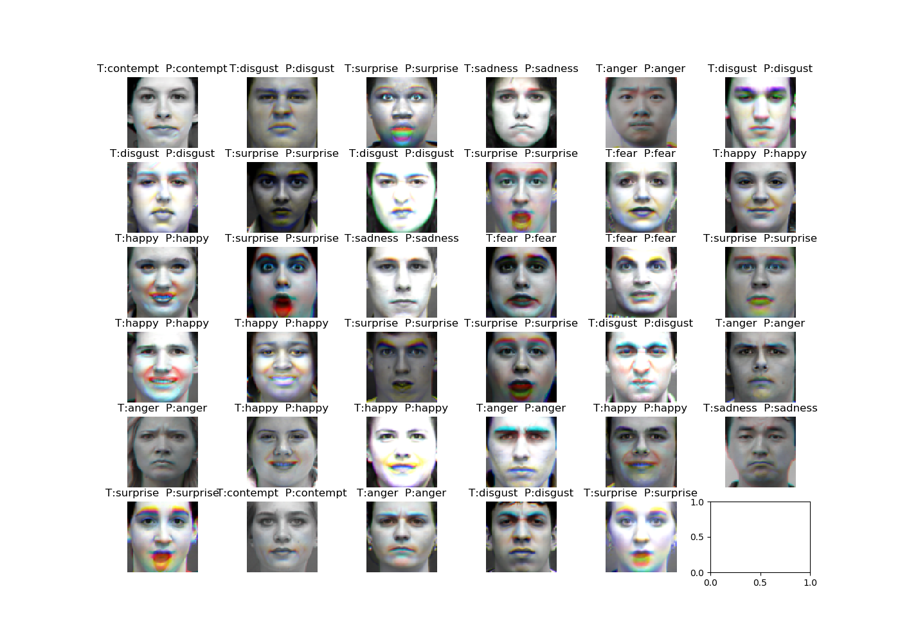
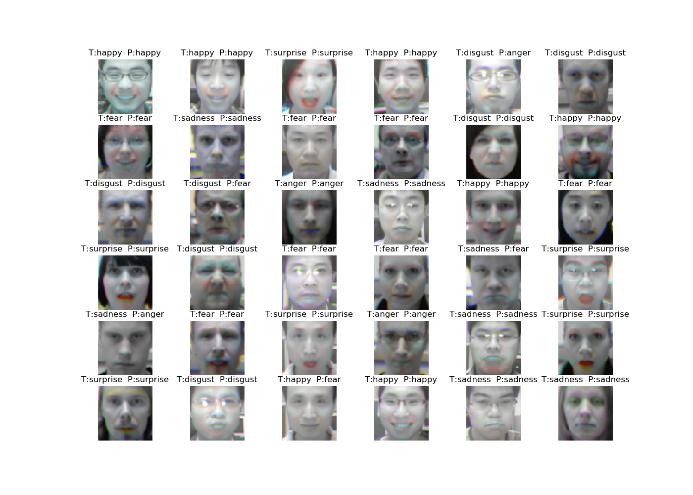

## Face age classification
PyTorch implementation of [DTAN](https://ieeexplore.ieee.org/document/7410698/) to recognize face expression on dataset CK+, Oulu-CASIA

<br/>

## Dependencies
* [Python 3.6](https://www.continuum.io/downloads)
* [PyTorch 0.4.0](http://pytorch.org/)

<br/>

## Usage

### 1. Cloning the repository
```bash
$ git clone https://github.com/HayeonLee/fer.git
$ cd fer
```

<br/>

### 2. Install packages
```bash
$ pip install -r requirements.txt
```

<br/>

### 3. Downloading & Preprocessing the dataset
#### CK+
(1) Get [Cohn-Kanade (CK+) dataset](http://www.consortium.ri.cmu.edu/ckagree/) link \
(2) Download CK+/extended-cohn-kanade-images.zip \
(3) Download CK+/Emotion_labels.zip \
(4) unzip (2), (3) files \
(5) Move *cohn-kanade-images* directory to *fer/data/cohn-kanade-images* <br/>
```bash
$ mv cohn-kanade-images data/cohn-kanade-images
```
(6) Move *Emotion* directory to *fer/data/Emotion* <br/>
```bash
$ mv Emotion data/Emotion
```
(7) Perform preprocessing to crop and align images
```bash
$ find data/cohn-kanade-images/ -name .DS_Store -exec rm -f {} \;
$ python preprocessing/face_alignment.py --data_path data/cohn-kanade-images \
                                         --db_name cohn-kanade-images \ 
                                         --new_name ck_align
```
*ck_align* directory will be generated under *data* folder

<br/>

#### Oulu-CASIA
(1) Download B_OriginalImg.zip of [Oulu-CASIA dataset](http://www.cse.oulu.fi/CMV/Downloads/Oulu-CASIA) <br/>
(2) Move *OriginalImg* directory to *data/OriginalImg* <br/>
```bash
$ unzip B_OriginalImg.zip
$ mv B_OriginalImg/OriginalImg data/
```
(3) Perform preprocessing to crop and align images
```bash
$ find data/OriginalImg/NI/Strong -name Thumbs.db -exec rm -f {} \;
$ python preprocessing/face_alignment.py --data_path data/OriginalImg/NI/Strong \
                                         --db_name OriginalImg/NI/Strong \
                                         --new_name oulu_align_ni
```
*oulu_align* directory will be generated under *data* folder

<br/>

### 3. Downloading pretrained model
#### CK+
Download [the pretrained model checkpoint](https://drive.google.com/open?id=1_9CBiHx8ZG0Rk7ZYVPcFliktTeYcdjQP) to test the model as 10 cross-fold validation
```bash
$ unzip ckplus.zip -d models/
```

<br/>

#### Oulu-CASIA
Download [the pretrained model checkpoint](https://drive.google.com/open?id=1OhlCWF7e1zzg7G7vSz28Q63Tq9roVbyz) to test the model as 10 cross-fold validation
```bash
$ unzip oulu.zip -d models/
```

<br/>

### 4. Testing
#### CK+
```bash
$ python main.py --mode valid --main_path ./ --image_dir data/ck_align \
                 --emotion_dir data/Emotion --cls 7 \
                 --model_name Nthfold --ithfold N\ 
                 --restore true --use_visdom False
```
N: 0~9
Sample result images will be saved under *fer/models/ckplus/Nthfold/results*

<br/>

#### Oulu-CASIA
```bash
$ python main.py --mode valid --main_path ./ --image_dir data/oulu_align_ni \
                 --emotion_dir None --cls 6 \
                 --model_name oulu/Nthfold --ithfold N \ 
                 --restore true --use_visdom False
```

<br/>

### 5. Training
#### CK+
```bash
$ python main.py --mode train --main_path ./ --image_dir data/ck_align \
                 --emotion_dir data/Emotion --cls 7 \
                 --model_name MODEL_NAME --ithfold N \ 
```

<br/>

#### Oulu-CASIA
```bash
$ python main.py --mode train --main_path fer --image_dir fer/oulu/data/oulu_align \
                 --emotion_dir None --cls 6 \
                 --model_name MODEL_NAME --ithfold N\ 
                 --crop_size 64 --image_size 64 --batch_size 32 \
                 --use_visdom True
```
<br/>

## Results
### CK+ Dataset
#### Accuracy (%)
  
| fold    | 0     | 1      | 2     | 3     | 4     | 5     | 6     | 7     | 8     | 9     | mean    |author|
| :----: |:----:| :----:|:----:|:----:|:----:|:----:|:----:|:----:|:----:|:----:|-----:|:----:|
| acc  | 94.29 |  100   | 97.14 | 100   |  100  |  100  |  100  | 90.63 | 86.67 |  100  |  96.87  |97.25|

</br>

#### Confusion matrix (%)
  
| True\Pred| Anger | Contempt|Disgust| Fear | Happy| Sadness| Surprise |
| :-----: |:-----:|:-----:|:-----:|:-----:|:-----:|:-----:|:-----:|
| Anger | 97.78|    |    |     |     |     | 2.22 |     | 
| Contempt |      |  100   |     |      |     |     |     |     | 
| Disgust  |     |     |100 |     |     |     |     |    | 
| Fear |     |        | 4.00 | 88.00 |      | 4.00  | 4.00 | 
| Happy  |      |  | 1.45 | | 98.55|  |    | | 
| Sadness  |     |  3.57  |  |  ||  92.86  | 3.57 | 
| Surprise  |      |  1.20   |  |  |  1.20  | 1.20  |  96.39 |

<br/>

#### Qualitative results


<br/>

### Oulu-Casia Dataset
#### Accuracy (%)
  
| fold    | 0     | 1      | 2     | 3     | 4     | 5     | 6     | 7     | 8     | 9     | mean     |author|
| :-----: |:-----:| :-----:|:-----:|:-----:|:-----:|:-----:|:-----:|:-----:|:-----:|:-----:|:-----:|:-----:|
| acc  | 87.5 |  79.16  | 75 | 89.58  |  85.42  |  81.25  |  83.33  | 83.33 | 81.25 |  81.25  | 82.67 | 81.46 |

</br>

#### Confusion matrix (%)
  
| True\Pred| Anger |Disgust| Fear | Happy| Sadness| Surprise |
| :-----: |:-----:|:-----:|:-----:|:-----:|:-----:|:-----:|
| Anger | 80| 13.75   |     |     | 6.25    |  |   
| Disgust  |  17.5  |71.25 |   5  |     | 6.25     |    |  
| Fear |      | 1.25 | 88.75 |   1.25   | 2.5  | 6.25 | 
| Happy  | 1.25  | 1.25 |7.5 | 90.00|  |    | | 
| Sadness  | 10 | 2.5 | 6.25 ||  81.25  |  | 
| Surprise  |    |  | 2.5 |    |  |  97.5|

<br/>

#### Qualitative results


<br/>

## Reference
* [[DTAN] Joint fine-tuning in deep neural networks for facial expression recognition](https://ieeexplore.ieee.org/document/7410698/) <br/> JUNG, Heechul, et al. In: Proceedings of the IEEE International Conference on Computer Vision. 2015. p. 2983-2991.<br/>
* [Face alignment code](https://www.pyimagesearch.com/2017/05/22/face-alignment-with-opencv-and-python/)

<br/>
